Geog6300: Lab 6
================

## Regression

``` r
library(sf)
library(tidyverse)
```

**Overview:** This lab focuses on regression techniques. You’ll be
analyzing the association of various physical and climatological
characteristics in Australia with observations of several animals
recorded on the citizen science app iNaturalist.

\###Data and research questions###

Let’s import the dataset.

``` r
lab6_data<-st_read("data/aus_climate_inat.gpkg")
```

    ## Reading layer `aus_climate_inat' from data source 
    ##   `C:\Users\18505\Downloads\geog4-6300-lab-6-mmr91362\data\aus_climate_inat.gpkg' 
    ##   using driver `GPKG'
    ## Simple feature collection with 716 features and 22 fields
    ## Geometry type: POLYGON
    ## Dimension:     XY
    ## Bounding box:  xmin: 113.875 ymin: -43.38632 xmax: 153.375 ymax: -11.92074
    ## Geodetic CRS:  WGS 84 (CRS84)

The dataset for this lab is a 1 decimal degree hexagon grid that has
aggregate statistics for a number of variables:

- ndvi: NDVI/vegetation index values from Landsat data (via Google Earth
  Engine). These values range from -1 to 1, with higher values
  indicating more vegetation.
- maxtemp_00/20_med: Median maximum temperature (C) in 2000 or 2020
  (data from SILO/Queensland government)
- mintemp_00/20_med: Median minimum temperature (C) in 2020 or 2020
  (data from SILO/Queensland government)
- rain_00/20_sum: Total rainfall (mm) in 2000 or 2020 (data from
  SILO/Queensland government)
- pop_00/20: Total population in 2000 or 2020 (data from NASA’s Gridded
  Population of the World)
- water_00/20_pct: Percentage of land covered by water at some point
  during the year in 2000 or 2020
- elev_med: Median elevation (meters) (data from the Shuttle Radar
  Topography Mission/NASA)

There are also observation counts from iNaturalist for several
distinctively Australian animal species: the central bearded dragon, the
common emu, the red kangaroo, the agile wallaby, the laughing
kookaburra, the wombat, the koala, and the platypus.

Our primary research question is how the climatological/physical
variables in our dataset are predictive of the NDVI value. We will build
models for 2020 as well as the change from 2000 to 2020. The second is
referred to as a “first difference” model and can sometimes be more
useful for identifying causal mechanisms.

\###Part 1: Analysis of 2020 data###

We will start by looking at data for 2020.

**Question 1** *Create histograms for NDVI, max temp., min temp., rain,
and population, and water in 2020 as well as elevation. Based on these
graphs, assess the normality of these variables.*

``` r
variables_2020 <- c("ndvi_20_med", "maxtemp_20_med", "mintemp_20_med", "rain_20_sum", "pop_20", "water_20_pct", "elev_med")

for (var in variables_2020) {
  hist(lab6_data[[var]], main = paste(var), xlab = var, col = "red", breaks = 30)}
```

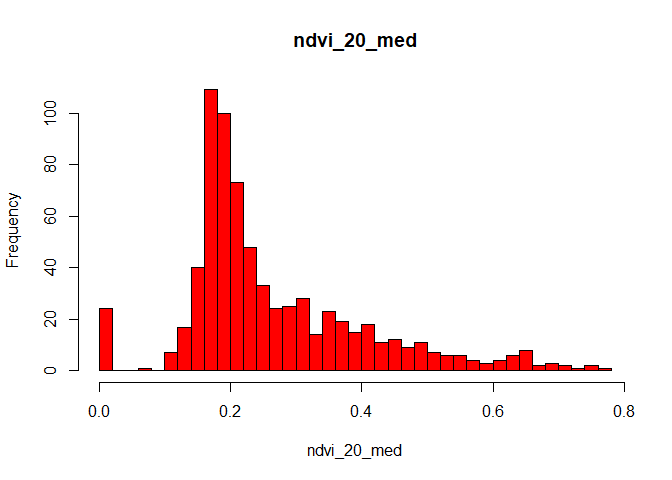<!-- -->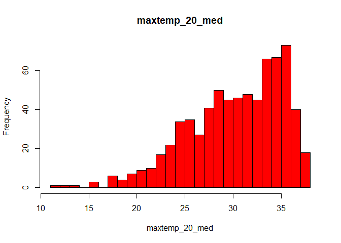<!-- -->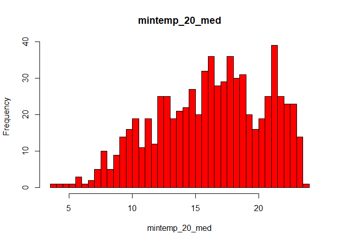<!-- -->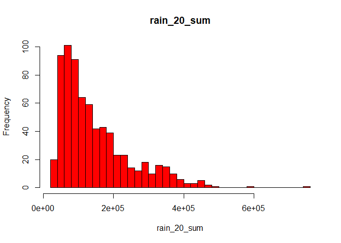<!-- -->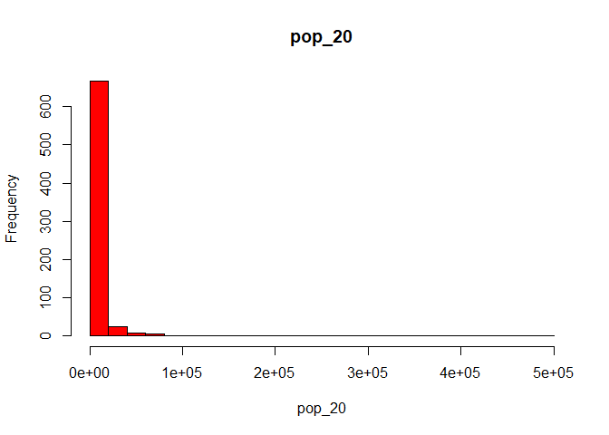<!-- -->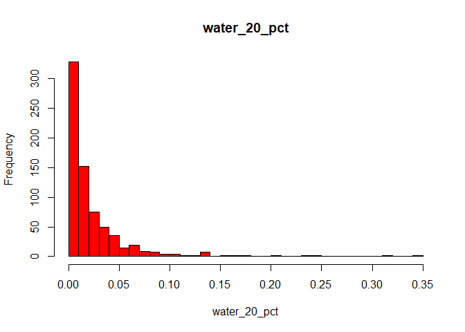<!-- -->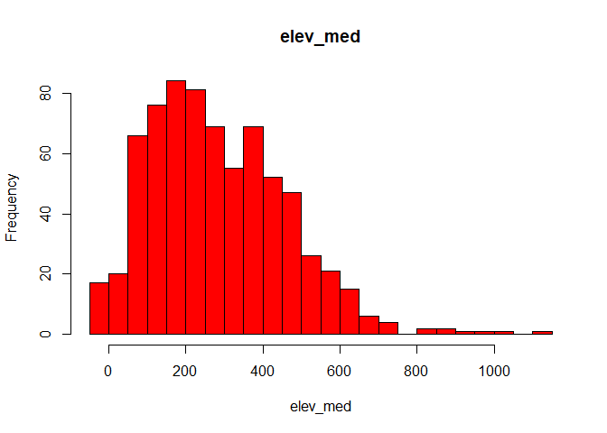<!-- -->

{Most of the variables in this analysis deviate from a normal
distribution trend. Elevation and temperature have shown distributions
closer to normality but still have slight skewing. Variables such as
rainfall, population, and water percentage showed the highest level of
skew with extreme deviations from normality.}

**Question 2** *Use tmap to map these same variables using Jenks natural
breaks as the classification method. For an extra challenge, use
`tmap_arrange` to plot all maps in a single figure.*

``` r
library(tmap)
```

    ## Breaking News: tmap 3.x is retiring. Please test v4, e.g. with
    ## remotes::install_github('r-tmap/tmap')

``` r
tm_list <- lapply(variables_2020, function(var) {
  tm_shape(lab6_data) +
    tm_polygons(var, style = "jenks", palette = "viridis", title = var) +
    tm_layout(
      title = paste(var),
      title.position = c("center", "top"),  
      legend.outside = TRUE,               
      legend.outside.position = "left",
      legend.frame = TRUE)})

tmap_arrange(plotlist = tm_list)
```

    ## Legend labels were too wide. The labels have been resized to 0.24, 0.24, 0.24, 0.24, 0.24. Increase legend.width (argument of tm_layout) to make the legend wider and therefore the labels larger.

    ## Legend labels were too wide. The labels have been resized to 0.24, 0.24, 0.24, 0.24, 0.24. Increase legend.width (argument of tm_layout) to make the legend wider and therefore the labels larger.

    ## Legend labels were too wide. The labels have been resized to 0.33, 0.29, 0.29, 0.29, 0.29. Increase legend.width (argument of tm_layout) to make the legend wider and therefore the labels larger.

    ## Legend labels were too wide. The labels have been resized to 0.21, 0.19, 0.18, 0.18, 0.18. Increase legend.width (argument of tm_layout) to make the legend wider and therefore the labels larger.

    ## Legend labels were too wide. The labels have been resized to 0.31, 0.21, 0.19, 0.18, 0.18. Increase legend.width (argument of tm_layout) to make the legend wider and therefore the labels larger.

    ## Legend labels were too wide. The labels have been resized to 0.24, 0.24, 0.24, 0.24, 0.24. Increase legend.width (argument of tm_layout) to make the legend wider and therefore the labels larger.

    ## Legend labels were too wide. The labels have been resized to 0.34, 0.32, 0.32, 0.32, 0.28. Increase legend.width (argument of tm_layout) to make the legend wider and therefore the labels larger.

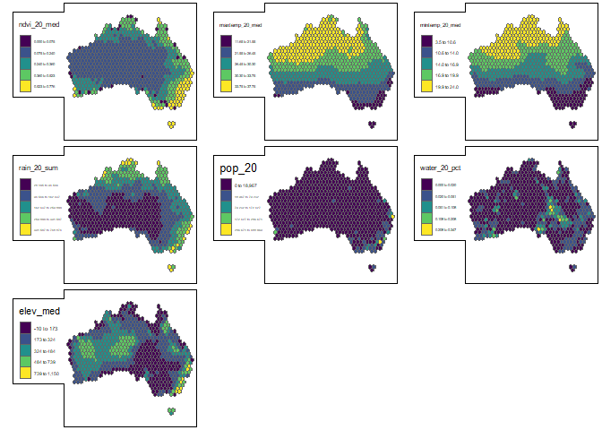<!-- -->

**Question 3** *Based on the maps from question 3, summarise major
patterns you see in the spatial distribution of these data from any of
your variables of interest. How do they appear to be associated with the
NDVI variable?*

{Variables such as rainfall, water percentage, and moderate temperatures
are positively associated with higher NDVI values, meaning their are
favorable conditions for vegetation growth. Areas with high maximum
temperatures and low rainfall located in the central and western regions
show a lower NDVI scale, meaning the condtions are less favorable for
vegetation growth in these areas. Population density does not show a
very clear relationship with the NDVI, naturally, more urban areas tend
to have less vegetation which doesnt doesnt have to be based on the
surrounding environment.}

**Question 4** *Create univariate models for each of the variables
listed in question 1, with NDVI in 2020 as the dependent variable. Print
a summary of each model. Write a summary of those results that indicates
the direction, magnitude, and significance for each model coefficient.*

``` r
uni_var_2020 <- lapply(variables_2020, function(var) {
  model <- lm(ndvi_20_med ~ lab6_data[[var]], data = lab6_data)
  summary(model)})
```

    ## Warning in summary.lm(model): essentially perfect fit: summary may be
    ## unreliable

``` r
uni_var_2020
```

    ## [[1]]
    ## 
    ## Call:
    ## lm(formula = ndvi_20_med ~ lab6_data[[var]], data = lab6_data)
    ## 
    ## Residuals:
    ##        Min         1Q     Median         3Q        Max 
    ## -1.511e-15 -5.100e-19  2.360e-18  6.260e-18  4.908e-17 
    ## 
    ## Coefficients:
    ##                    Estimate Std. Error    t value Pr(>|t|)    
    ## (Intercept)      -1.328e-16  4.571e-18 -2.905e+01   <2e-16 ***
    ## lab6_data[[var]]  1.000e+00  1.525e-17  6.559e+16   <2e-16 ***
    ## ---
    ## Signif. codes:  0 '***' 0.001 '**' 0.01 '*' 0.05 '.' 0.1 ' ' 1
    ## 
    ## Residual standard error: 5.723e-17 on 714 degrees of freedom
    ## Multiple R-squared:      1,  Adjusted R-squared:      1 
    ## F-statistic: 4.302e+33 on 1 and 714 DF,  p-value: < 2.2e-16
    ## 
    ## 
    ## [[2]]
    ## 
    ## Call:
    ## lm(formula = ndvi_20_med ~ lab6_data[[var]], data = lab6_data)
    ## 
    ## Residuals:
    ##      Min       1Q   Median       3Q      Max 
    ## -0.41874 -0.07657 -0.01927  0.06833  0.36382 
    ## 
    ## Coefficients:
    ##                    Estimate Std. Error t value Pr(>|t|)    
    ## (Intercept)       0.6612389  0.0294372   22.46   <2e-16 ***
    ## lab6_data[[var]] -0.0130902  0.0009601  -13.63   <2e-16 ***
    ## ---
    ## Signif. codes:  0 '***' 0.001 '**' 0.01 '*' 0.05 '.' 0.1 ' ' 1
    ## 
    ## Residual standard error: 0.1251 on 714 degrees of freedom
    ## Multiple R-squared:  0.2066, Adjusted R-squared:  0.2055 
    ## F-statistic: 185.9 on 1 and 714 DF,  p-value: < 2.2e-16
    ## 
    ## 
    ## [[3]]
    ## 
    ## Call:
    ## lm(formula = ndvi_20_med ~ lab6_data[[var]], data = lab6_data)
    ## 
    ## Residuals:
    ##      Min       1Q   Median       3Q      Max 
    ## -0.36375 -0.08418 -0.03047  0.06972  0.40383 
    ## 
    ## Coefficients:
    ##                   Estimate Std. Error t value Pr(>|t|)    
    ## (Intercept)       0.464461   0.018997   24.45   <2e-16 ***
    ## lab6_data[[var]] -0.012282   0.001131  -10.86   <2e-16 ***
    ## ---
    ## Signif. codes:  0 '***' 0.001 '**' 0.01 '*' 0.05 '.' 0.1 ' ' 1
    ## 
    ## Residual standard error: 0.1301 on 714 degrees of freedom
    ## Multiple R-squared:  0.1418, Adjusted R-squared:  0.1406 
    ## F-statistic:   118 on 1 and 714 DF,  p-value: < 2.2e-16
    ## 
    ## 
    ## [[4]]
    ## 
    ## Call:
    ## lm(formula = ndvi_20_med ~ lab6_data[[var]], data = lab6_data)
    ## 
    ## Residuals:
    ##      Min       1Q   Median       3Q      Max 
    ## -0.56681 -0.04753 -0.01210  0.04599  0.30930 
    ## 
    ## Coefficients:
    ##                   Estimate Std. Error t value Pr(>|t|)    
    ## (Intercept)      1.303e-01  7.060e-03   18.45   <2e-16 ***
    ## lab6_data[[var]] 9.124e-07  3.953e-08   23.08   <2e-16 ***
    ## ---
    ## Signif. codes:  0 '***' 0.001 '**' 0.01 '*' 0.05 '.' 0.1 ' ' 1
    ## 
    ## Residual standard error: 0.1063 on 714 degrees of freedom
    ## Multiple R-squared:  0.4273, Adjusted R-squared:  0.4265 
    ## F-statistic: 532.6 on 1 and 714 DF,  p-value: < 2.2e-16
    ## 
    ## 
    ## [[5]]
    ## 
    ## Call:
    ## lm(formula = ndvi_20_med ~ lab6_data[[var]], data = lab6_data)
    ## 
    ## Residuals:
    ##      Min       1Q   Median       3Q      Max 
    ## -0.47003 -0.07883 -0.03949  0.06384  0.48974 
    ## 
    ## Coefficients:
    ##                   Estimate Std. Error t value Pr(>|t|)    
    ## (Intercept)      2.552e-01  5.013e-03  50.902   <2e-16 ***
    ## lab6_data[[var]] 1.500e-06  1.500e-07   9.998   <2e-16 ***
    ## ---
    ## Signif. codes:  0 '***' 0.001 '**' 0.01 '*' 0.05 '.' 0.1 ' ' 1
    ## 
    ## Residual standard error: 0.1316 on 714 degrees of freedom
    ## Multiple R-squared:  0.1228, Adjusted R-squared:  0.1216 
    ## F-statistic: 99.97 on 1 and 714 DF,  p-value: < 2.2e-16
    ## 
    ## 
    ## [[6]]
    ## 
    ## Call:
    ## lm(formula = ndvi_20_med ~ lab6_data[[var]], data = lab6_data)
    ## 
    ## Residuals:
    ##      Min       1Q   Median       3Q      Max 
    ## -0.26898 -0.08838 -0.04838  0.06871  0.50911 
    ## 
    ## Coefficients:
    ##                   Estimate Std. Error t value Pr(>|t|)    
    ## (Intercept)       0.268988   0.006287  42.781   <2e-16 ***
    ## lab6_data[[var]] -0.178263   0.154480  -1.154    0.249    
    ## ---
    ## Signif. codes:  0 '***' 0.001 '**' 0.01 '*' 0.05 '.' 0.1 ' ' 1
    ## 
    ## Residual standard error: 0.1403 on 714 degrees of freedom
    ## Multiple R-squared:  0.001862,   Adjusted R-squared:  0.0004636 
    ## F-statistic: 1.332 on 1 and 714 DF,  p-value: 0.2489
    ## 
    ## 
    ## [[7]]
    ## 
    ## Call:
    ## lm(formula = ndvi_20_med ~ lab6_data[[var]], data = lab6_data)
    ## 
    ## Residuals:
    ##      Min       1Q   Median       3Q      Max 
    ## -0.27082 -0.09585 -0.04270  0.07954  0.44272 
    ## 
    ## Coefficients:
    ##                   Estimate Std. Error t value Pr(>|t|)    
    ## (Intercept)      2.138e-01  9.741e-03  21.952  < 2e-16 ***
    ## lab6_data[[var]] 1.787e-04  2.895e-05   6.171 1.14e-09 ***
    ## ---
    ## Signif. codes:  0 '***' 0.001 '**' 0.01 '*' 0.05 '.' 0.1 ' ' 1
    ## 
    ## Residual standard error: 0.1369 on 714 degrees of freedom
    ## Multiple R-squared:  0.05064,    Adjusted R-squared:  0.04931 
    ## F-statistic: 38.08 on 1 and 714 DF,  p-value: 1.136e-09

{Most variables are highly significant (NDVI, max temp, min temp, rain,
population, and elevation), with p-values less than 0.001, except for
variable 6 (Water in 2020), which is not statistically significant due
to having the p-value 0.249. Rain, population, and elevation show that
the independent variable had a very small impact on the NDVI. The
highest influence on the NDVI was found in the rain variable with a r
squared of 0.4273 or (42.73%), while the lowest is in the water in 2020
variable with a r squared of 0.001862 or (0.186%).This data shows that
the variables with higher r squared percentages fit the regression model
better than the variables with a lower r squared percentage. So, the
higher r squared values (observed in the NDVI, max temp, min temp, rain,
population) means there is less variation between observed data in the
fitted values where as a lower r squared value (observed in the water
2020 and elevation) means there was bigger differences or more variation
between data and the fit. The magnitudes of the coefficients vary, with
some close to 1 (Model 1 = 1.000×10^0) indicating a perfect or
near-perfect relationship, while others are small (Model 4 =
9.124×10^−7) but still significant, suggesting subtle effects on the
NDVI. These numbers tell us how well the independent variable explains
or predicts the NDVI values. Model 1 shows dominance, Model 4 showing a
moderate but important role, and Model 6 showing negligible impact on
the NDVI.}

**Question 5** *Create a multivariate regression model with the
variables of interest, choosing EITHER max or min temperature (but not
both) You may also choose to leave out any variables that were
insignificant in Q4. Use the univariate models as your guide. Call the
results.*

``` r
multi_var_2020 <- lm(ndvi_20_med ~ maxtemp_20_med + rain_20_sum + pop_20 + water_20_pct + elev_med, data = lab6_data)
summary(multi_var_2020)
```

    ## 
    ## Call:
    ## lm(formula = ndvi_20_med ~ maxtemp_20_med + rain_20_sum + pop_20 + 
    ##     water_20_pct + elev_med, data = lab6_data)
    ## 
    ## Residuals:
    ##      Min       1Q   Median       3Q      Max 
    ## -0.50306 -0.02849  0.00444  0.03912  0.20545 
    ## 
    ## Coefficients:
    ##                  Estimate Std. Error t value Pr(>|t|)    
    ## (Intercept)     4.591e-01  2.272e-02  20.206  < 2e-16 ***
    ## maxtemp_20_med -1.173e-02  6.834e-04 -17.160  < 2e-16 ***
    ## rain_20_sum     8.464e-07  3.269e-08  25.887  < 2e-16 ***
    ## pop_20          2.873e-07  1.045e-07   2.749  0.00613 ** 
    ## water_20_pct   -3.387e-02  9.717e-02  -0.349  0.72750    
    ## elev_med        1.215e-04  1.862e-05   6.526 1.28e-10 ***
    ## ---
    ## Signif. codes:  0 '***' 0.001 '**' 0.01 '*' 0.05 '.' 0.1 ' ' 1
    ## 
    ## Residual standard error: 0.08455 on 710 degrees of freedom
    ## Multiple R-squared:  0.6397, Adjusted R-squared:  0.6372 
    ## F-statistic: 252.1 on 5 and 710 DF,  p-value: < 2.2e-16

**Question 6** *Summarize the results of the multivariate model. What
are the direction, magnitude, and significance of each coefficient? How
did it change from the univariate models you created in Q4 (if at all)?
What do the R2 and F-statistic values tell you about overall model fit?*

{The model helps explain a good chunk of the changes happening within
the NDVI. The high R-value (0.6397, adjusted 0.6372) and the F-statistic
(252.1 with 5 and 710 DF) suggest that the selected variables are
suitable for modeling an NDVI.

Intercept: The given estimate is (0.4591) which means that if all the
independent variables are at 0, the predicted NDVI is 0.4591. This
result is highly significant due to having a p-value of (2x10^-16).

maxtemp_20_med: This variable has a negative relationship.The maximum
temperature shows a 1 degree Celsius increase which can be associated
with a the -0.01173 decrease found within the NDVI. The p-value shows
high significance (p \< 2x10^-16).

Rain_20_sum: The variable has a positive relationship with a value of
(8.464x10^-7) which means that rainfall slightly increases within the
NDVI. The result is highly significant with a p-value of (2x10^-16).

pop_20: This variable has a positive relationship with a value of
(2.873x10^-7) which means that a one-person increase in population
creates an increase in the NDVI. The result is slightly significant with
a p-value of (p = 0.00613).

water_20_pct: This variable has a negative relationship with a value of
(-0.03387) which means that an increase in water coverage creates a
decrease in NDVI. This result is not significant with a p-value of
(0.7275).

elev_med: This variable has a positive relationship with a value of
(0.0001215) which means that an increase in elevation creates an
increase in NDVI. This result is highly significant with a p-valye of
(1.28x10^-10).}

**Question 7** *Use a histogram and a map to assess the normality of
residuals and any spatial autocorrelation. Summarise any notable
patterns that you see.*

``` r
lab6_data$residuals <- residuals(multi_var_2020)

ggplot(lab6_data, aes(sample = residuals)) +
  stat_qq() +
  stat_qq_line()
```

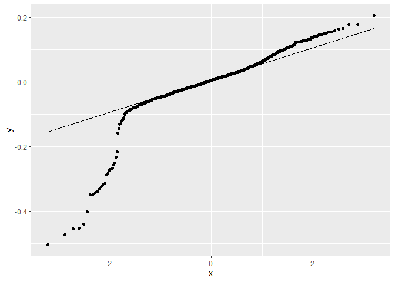<!-- -->

``` r
shapiro.test(lab6_data$residuals)
```

    ## 
    ##  Shapiro-Wilk normality test
    ## 
    ## data:  lab6_data$residuals
    ## W = 0.81938, p-value < 2.2e-16

``` r
ggplot(lab6_data, aes(x = residuals)) +
  geom_histogram(binwidth = 0.1, fill = "blue", color = "black", alpha = 0.7) +
  labs(title = "Residuals", x = "Residuals", y = "Frequency") +
  theme_minimal()
```

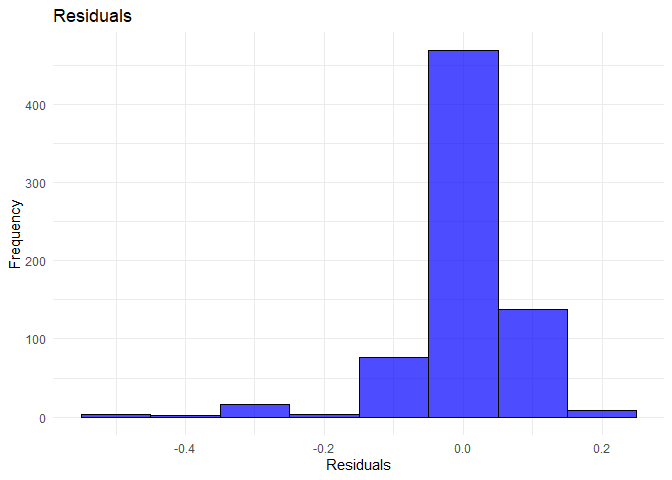<!-- -->

``` r
tm_shape(lab6_data) +
  tm_dots("residuals", size = 0.2)
```

    ## Variable(s) "residuals" contains positive and negative values, so midpoint is set to 0. Set midpoint = NA to show the full spectrum of the color palette.

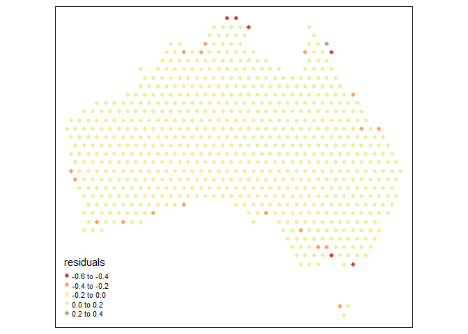<!-- -->

{Most of the residuals are around zero or very low, meaning they are a
good fit. There are slight deviations in normality, with a longer left
tail and a few outliers on both sides. The presence of outliers suggests
the model might have difficulty handling extreme cases but the residual
clustering outcome indacates an overall good performance for the
majority of observations.The outliers on the map are represented by the
red and green dots because they reflect the ranges furthest from zero.
These outliers are mostly present in coastal areas and could be affected
by human or environmental factors.}

**Question 8** *Assess any issues with multicollinearity or
heteroskedastity in this model using the techniques shown in class. Run
the appropriate tests and explain what their results show you.*

``` r
library(car)
```

    ## Warning: package 'car' was built under R version 4.4.2

    ## Loading required package: carData

    ## Warning: package 'carData' was built under R version 4.4.2

    ## 
    ## Attaching package: 'car'

    ## The following object is masked from 'package:dplyr':
    ## 
    ##     recode

    ## The following object is masked from 'package:purrr':
    ## 
    ##     some

``` r
vif(multi_var_2020)
```

    ## maxtemp_20_med    rain_20_sum         pop_20   water_20_pct       elev_med 
    ##       1.109442       1.081126       1.174874       1.090059       1.084266

``` r
ncvTest(multi_var_2020)
```

    ## Non-constant Variance Score Test 
    ## Variance formula: ~ fitted.values 
    ## Chisquare = 287.3917, Df = 1, p = < 2.22e-16

{The values range from 1.08 to 1.17, which are all below the typical
threshold for potential multicollinearity analysis. This means
multicollinearity is not ideal to use for this model, as the varaibles
are not strongly correlated. The NCV test has a chi-square value of
287.39, with 1 DF and a p-value less than (2.22 × 10^-16). This
indicates a highly significant results. The test also shows that the
assumption of homoscedasticity is not met, which means the spread of the
residuals isn’t the same across the predicted values. This suggests the
presence of heteroscedasticity in the model.}

**Question 9** *How would you summarise the results of this model in a
sentence or two? In addition, looking at the full model and your
diagnostics, do you feel this is a model that provides meaningful
results? Explain your answer.*

{This model provides meaningful results that can help predict NDVI
trends and the variance of individual variables. I found the results of
the maps to be the most meaningful as a geographer because they
incorporate the spatial connection between the data and the natural
environment. The outliers on the map highlighted areas of concern or
possible data inconsistencies. These inconsistencies (specifically
around the coast) could provide insight into possible causes such as
humans or certain environmental factors. The heteroskedasticity
emphasizes possible limitations with the standard errors and
significance tests. This is more a question of their accuracy.
Adjustments can be made such as using standard errors or alternative
models which could help support their validity. In summary, with the
results from Q4, Model 1 shows that the NDVI variable perfectly explains
itself (R2=1), Model 4 demonstrates a significant relationship between
rainfall and NDVI (R2 =0.4273), suggesting rainfall is a key driver of
vegetation health, and Model 6 reveals that elevation has little to no
direct influence on NDVI (R2=0.00186), indicating it may affect
vegetation indirectly or not significantly in this dataset.}

**Disclosure of assistance:** *Besides class materials, what other
sources of assistance did you use while completing this lab? These can
include input from classmates, relevant material identified through web
searches (e.g., Stack Overflow), or assistance from ChatGPT or other AI
tools. How did these sources support your own learning in completing
this lab?*

{I got an error on question 2 regarding a sizing format that I had to
run through ChatGPT. Specifically “Legend labels were too wide. The
labels have been resized to 0.24, 0.24, 0.24, 0.24, 0.24. Increase
legend.width (argument of tm_layout) to make the legend wider and
therefore the labels larger.”}

**Lab reflection:** *How do you feel about the work you did on this lab?
Was it easy, moderate, or hard? What were the biggest things you learned
by completing it?*

{This lab was fun. I enjoyed learning about the application of an NDVI
in R. Although, I did have some very odd errors I had to troublshoot
through.}
